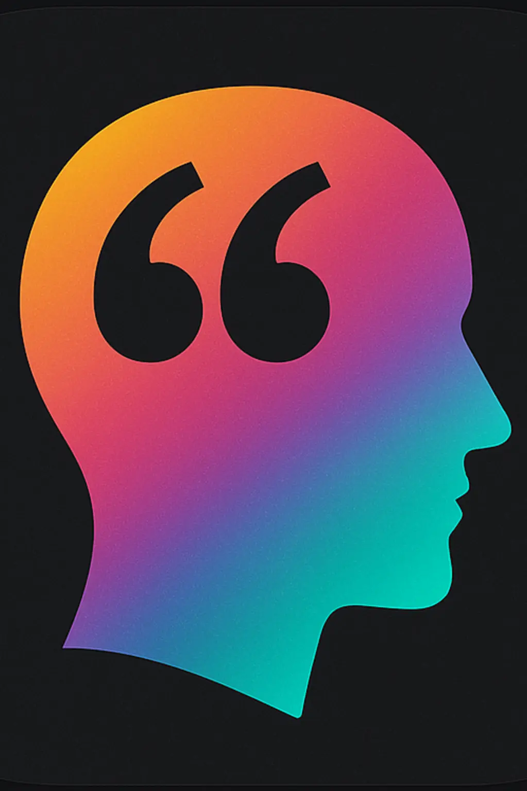
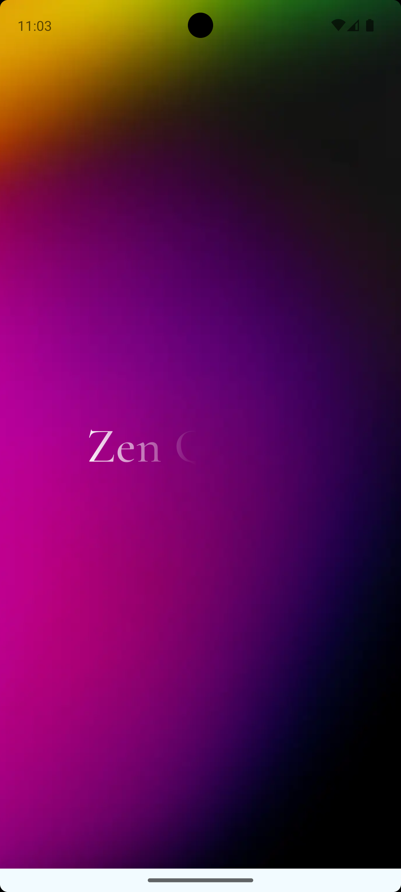
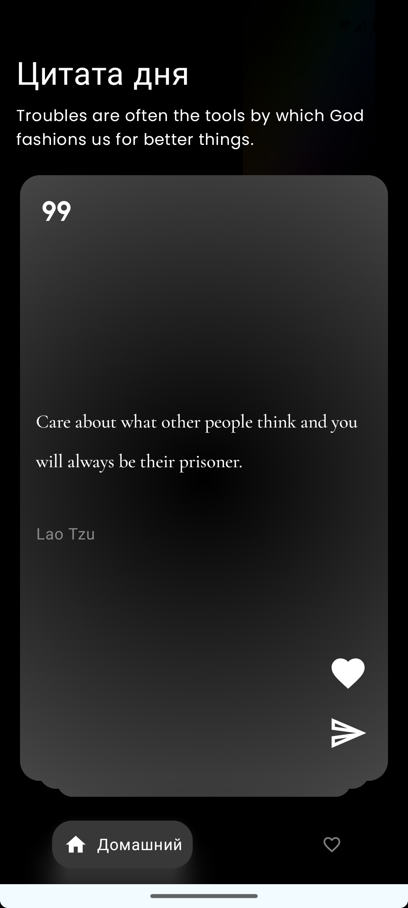
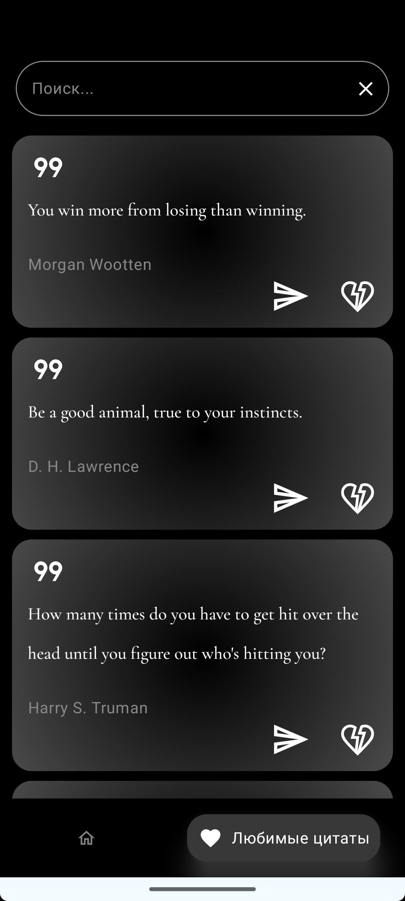
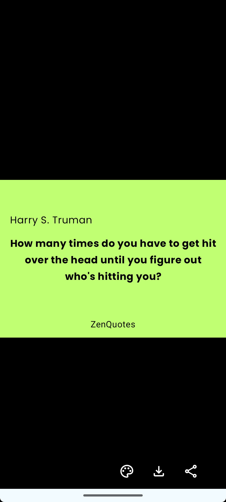
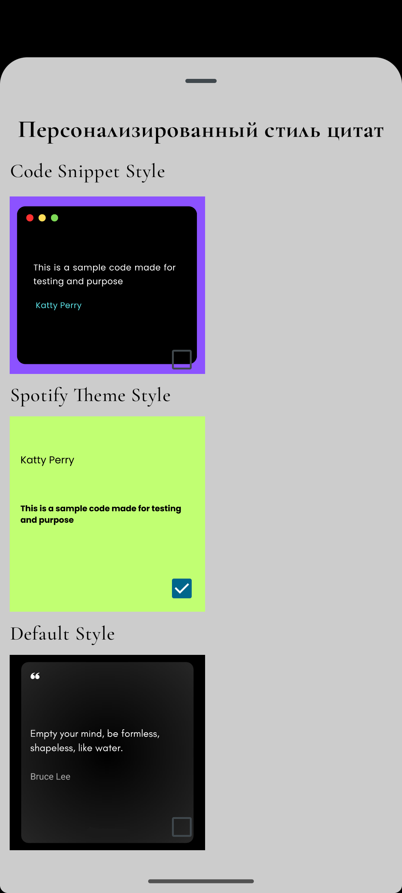

  
  
  <h1>Zen Quotes</h1>
  <h4>Вдохновляющие цитаты для мотивации от известных и успешных людей</h4>

# Скриншоты

  
  
  
  
  

# Возможности
- **Просмотр цитат и цитаты дня**;
- **Свайп карточек с цитатами**;
- **Добавление и удаление цитат из избранных**;
- **Выбор темы определенной цитаты перед возможностью сохранить или поделиться ей**;
- **Сохранение цитаты в галерею**;
- **Возможность поделиться цитатой**;
- **Поиск среди любимых цитат**;
- **Виджет с цитатой дня с возможностью добавления на главный экран устройства, обновляется один раз в 24 часа**.

# Используемый стек
- **Kotlin**;
- **Single Activity Application паттерн**;
- **Многомодульность**;
- **Чистая архитектура**;
- **Dagger Hilt для DI**;
- **UDF архитектура презентационного слоя (ELM с использованием библиотеки ELMSlie версии 3) - 2 основные фичи (Домашний экран и Любимые цитаты)**;
- **MVVM архитектура презентационного слоя - 1 небольшая фича (Экран "Поделиться цитатой")**;
- **Retrofit + Kotlin Serialization для сетевого взаимодействия**;
- **Kotlin Coroutines + Flow для асинхронных операций**;
- **Room для локальной базы данных**;
- **WorkManager для служб уведомлений и обновления виджета**;
- **UI на Jetpack Compose**;
- **Для навигации используется Jetpack Compose Navigation (NavHost) и Bottom Navigation**;
- **JUnit для тестирования**;
- **Плагин Detekt для статического анализа кода**.

## REST API
[Zen Quotes API](https://docs.zenquotes.io)

## Дальнейший фокус на развитии проекта
1) Реализация фичей:
    - Показывать цитаты за определенный день (самые популярные события или цитаты за определенный день);
    - Возможность перевода цитат с помощью добавления стороннего API;
    - Интеграция с ИИ для промптов вдохновления и мотивации;
2) Добавление универсального плагина Gradle для настройки;
3) Модернизировать дизайн.
